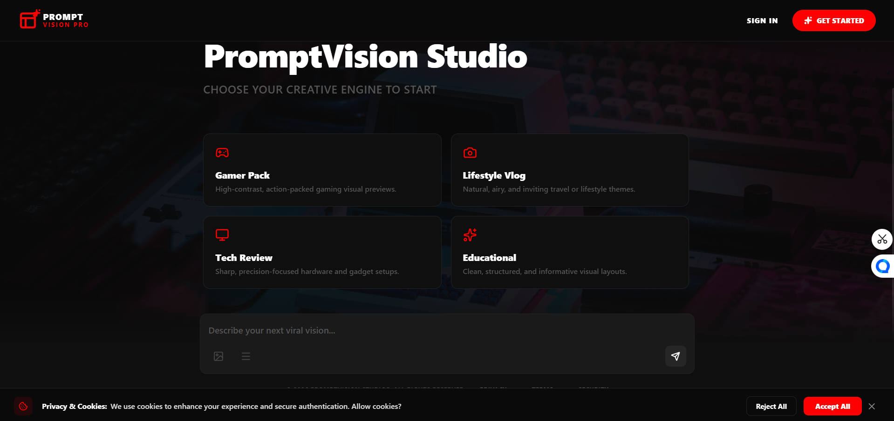
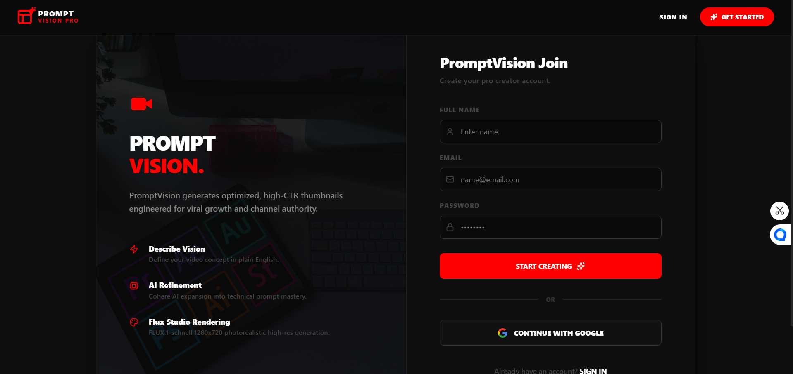

# PromptVision Studio

PromptVision Studio is a YouTube thumbnail generation platform built with React, Vite, Node.js, Express, MongoDB, Cohere, and Hugging Face. The app lets users log in, write a prompt, generate a thumbnail, and revisit previous generations from a threaded history view.

## What The Platform Does

- Turns a short idea into a refined thumbnail prompt
- Generates a thumbnail image from that prompt
- Stores generations in a conversation thread per user
- Lets users reopen past threads and delete old work
- Supports Google sign-in as well as email and password auth
- Includes privacy, security, terms, and consent pages

## Tech Stack

- Frontend: React, Vite, React Router, Framer Motion, Axios, Lucide icons
- Backend: Node.js, Express, MongoDB, Mongoose, JWT, CORS, dotenv
- AI services: Cohere prompt refinement and Hugging Face image generation

## Screenshots

Add your screenshot files in the root screenshots folder:

- `screenshots/landing.png`
- `screenshots/home.png`
- `screenshots/login.png`
- `screenshots/register.png`

Once you replace the images, the README displays them like this:

- Landing: 
- Home: 
- Login: 
- Register: 

## How To Use The Platform

1. Copy `backend/.env.example` → `backend/.env` and fill in secrets.
2. Copy `frontend/.env.example` → `frontend/.env` and set `VITE_GOOGLE_CLIENT_ID` (local dev only).
3. Run `npm run install:all` from the repo root.
4. For development: `npm run dev:backend` + `npm run dev:frontend`, open **http://localhost:5173**.
5. For production-like local: `npm run build` then `npm start`, open **http://localhost:5000**.
6. Register or sign in with email/password or Google.
7. On the home screen, choose a preset or type a custom idea.
8. Submit the prompt to generate a thumbnail.
9. Open the sidebar to review your saved history.
10. Open any previous thread or delete it when needed.

## Local Development

**Option A — two terminals (hot reload, recommended for UI work)**

```bash
npm run install:all
```

Terminal 1 — API:

```bash
npm run dev:backend
```

Terminal 2 — Vite dev server (proxies `/api` → backend):

```bash
npm run dev:frontend
```

Open **http://localhost:5173**

**Option B — single server (matches production)**

```bash
npm run install:all
npm run build
cd backend && npm run dev
```

Open **http://localhost:5000** — frontend and API on one port.

## Deploy on Render (single web service)

The repo is set up so **one Node server** builds the React app and serves everything:

1. Push to GitHub and connect the repo on [Render](https://render.com).
2. Use the included `render.yaml` (or create a **Web Service** manually):
   - **Build command:** `npm run install:all && npm run build`
   - **Start command:** `npm start`
   - **Health check:** `/api/health`
3. Set environment variables in Render:

| Variable | Notes |
|----------|--------|
| `NODE_ENV` | `production` |
| `CLIENT_URL` | Your Render URL, e.g. `https://your-app.onrender.com` |
| `VITE_GOOGLE_CLIENT_ID` | Same as Google OAuth client ID (needed at **build** time) |
| `GOOGLE_CLIENT_ID` | Google OAuth client ID |
| `MONGO_URI` | MongoDB connection string |
| `JWT_SECRET` | Random secret string |
| `COHERE_API_KEY` | Cohere API key |
| `HUGGINGFACE_TOKEN` | Hugging Face token |
| `ADMIN_EMAIL` | Optional admin dashboard email |

4. In Google Cloud Console, add your Render URL to **Authorized JavaScript origins** and redirect URIs.

The frontend uses `baseURL: '/api'`, so no separate frontend deploy is required.

## Production Build

From the repo root:

```bash
npm run build
npm start
```

The backend serves `frontend/dist` when the build exists.

## Available Routes

Frontend pages:

- `/`
- `/login`
- `/register`
- `/privacy`
- `/terms`
- `/security`

API routes:

- `GET /api/health`
- `POST /api/auth/register`
- `POST /api/auth/login`
- `POST /api/auth/google`
- `GET /api/auth/me`
- `POST /api/auth/logout`
- `POST /api/images/generate`
- `GET /api/images/history`
- `DELETE /api/images/:id`

## Notes

- Auth uses an httpOnly cookie (JWT) set by the backend. The frontend calls `/api/auth/me` on load to restore the session.
- The app uses `baseURL: /api`, so frontend and backend should be served under the same origin in production.
- `render.yaml` is configured to build the frontend and start the backend service.
