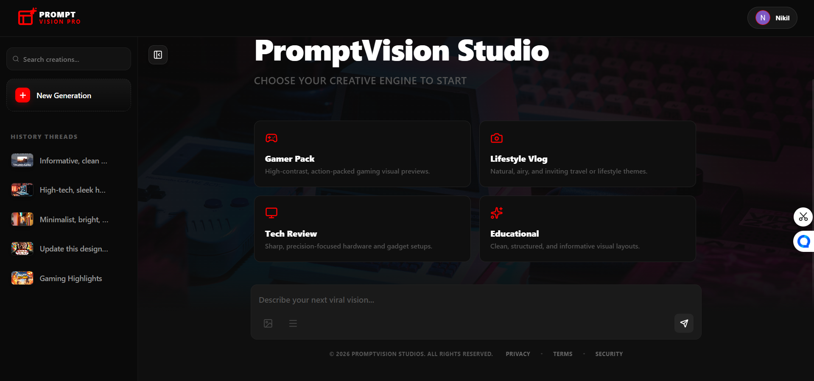
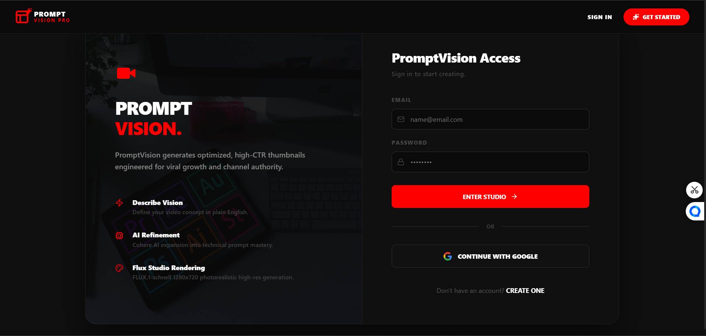

# PromptVision Studio

PromptVision Studio is a YouTube thumbnail generation platform built with React, Vite, Node.js, Express, MongoDB, Cohere, and Hugging Face. The app lets users log in, write a prompt, generate a thumbnail, and revisit previous generations from a threaded history view.

## What The Platform Does

- Turns a short idea into a refined thumbnail prompt
- Generates a thumbnail image from that prompt
- Stores generations in a conversation thread per user
- Lets users reopen past threads and delete old work
- Supports Google sign-in as well as email and password auth
- Includes privacy, security, terms, and consent pages

## Tech Stack

- Frontend: React, Vite, React Router, Framer Motion, Axios, Lucide icons
- Backend: Node.js, Express, MongoDB, Mongoose, JWT, CORS, dotenv
- AI services: Cohere prompt refinement and Hugging Face image generation

## Screenshots

Add your screenshot files here:

- `src/assets/screenshots/landing.png`
- `src/assets/screenshots/home.png`
- `src/assets/screenshots/login.png`
- `src/assets/screenshots/register.png`

If you want to keep the repo structure explicit, these are the same files relative to the project root:

- `frontend/src/assets/screenshots/landing.png`
- `frontend/src/assets/screenshots/home.png`
- `frontend/src/assets/screenshots/login.png`
- `frontend/src/assets/screenshots/register.png`

Once you replace the images, the README can display them like this:

- Landing: 
- Home: 
- Login: 
- Register: 

## How To Use The Platform

1. Create a `.env` file for the frontend and set `VITE_GOOGLE_CLIENT_ID`.
2. Create a `.env` file for the backend and set `MONGO_URI`, `JWT_SECRET`, `GOOGLE_CLIENT_ID`, `COHERE_API_KEY`, and `HUGGINGFACE_TOKEN`.
3. Start the backend server.
4. Start the frontend development server.
5. Open the app in the browser.
6. Register or sign in with email/password or Google.
7. On the home screen, choose a preset or type a custom idea.
8. Submit the prompt to generate a thumbnail.
9. Open the sidebar to review your saved history.
10. Open any previous thread or delete it when needed.

## Local Development

Install dependencies for both apps first:

```bash
cd backend
npm install

cd ../frontend
npm install
```

Run the backend:

```bash
cd backend
npm run dev
```

Run the frontend:

```bash
cd frontend
npm run dev
```

## Production Build

Build the frontend for deployment:

```bash
cd frontend
npm run build
```

The backend serves the built frontend when `frontend/dist` exists.

## Available Routes

Frontend pages:

- `/`
- `/login`
- `/register`
- `/privacy`
- `/terms`
- `/security`

API routes:

- `GET /api/health`
- `POST /api/auth/register`
- `POST /api/auth/login`
- `POST /api/auth/google`
- `POST /api/images/generate`
- `GET /api/images/history`
- `DELETE /api/images/:id`

## Notes

- Auth state is stored in `localStorage` as a token plus user profile data.
- The app uses `baseURL: /api`, so frontend and backend should be served under the same origin in production.
- `render.yaml` is configured to build the frontend and start the backend service.

## Commands

```bash
npm run dev
npm run build
npm run lint
```
